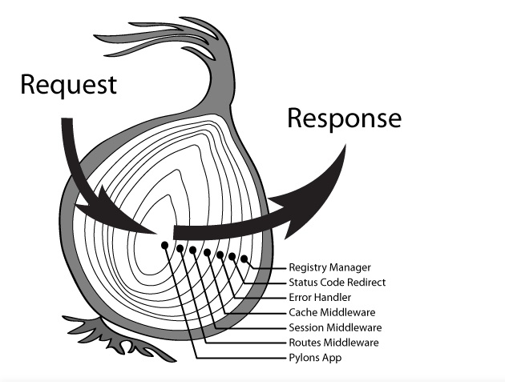

# Koa2源码解读

`Koa` 是⼀个新的 `web` 框架， 致⼒于成为 `web` 应⽤和 `API` 开发领域中的⼀个更⼩、更富有表现⼒、更健壮的基⽯。

特点：
- 轻量，⽆捆绑
- 中间件架构
- 优雅的API设计
- 增强的错误处理

安装
```bash
npm i koa -S
```

## 基本使用
```js
const Koa = require('koa');
const app = new Koa();
app.use((ctx, next) => {
  ctx.body = [
    {
      content: "koa框架"
    }
  ]
  next()
})


app.use((ctx, next) => {
  console.log("url: " + ctx.url);
  if(ctx.url === '/index.html') {
    ctx.type = 'text/html;charset=utf-8';
    ctx.body = `<h1>koa框架</h1>`
  }
  next()
})

app.listen(3000);
```

## 常见的中间件操作

- 静态服务

```bash
npm i koa-static --save-dev
```

`koa-static` 是`koa`（node框架）中最常用的、较为成熟的 静态`web`托管服务中间件。
```js
app.use(require('koa-static')(__dirname + '/'));
```
当添加以上中间件后，可以在`url`上输入对应的文件名即可进行访问。

比如说有个`data.txt`文件，那么可以直接在`url`上输入`/data.txt`进行文件的读取。

- 路由
```bash
npm i koa-router --save-dev
```

```js
const Koa = require('koa');
const app = new Koa();
const router = require('koa-router')()

router.get('/string', async (ctx, next) => {
  ctx.body = 'koa2 string';
});
router.get('/json', async (ctx, next) => {
  ctx.body = {
    title: 'koa2 json'
  };
})

app.use(router.routes());
app.listen(3000);
```

- 日志
```js
app.use(async (ctx,next) => {
  const start = new Date().getTime()
  console.log(`start: ${ctx.url}`);
  await next();
  const end = new Date().getTime()
  console.log(`请求${ctx.url}, 耗时${parseInt(end-start)}ms`)
})
```

## koa原理

⼀个基于`nodejs`的⼊⻔级`http`服务，类似下⾯代码:
```js
const http = require('http'); 
const fs = require('fs');
const server = http.createServer((request, response) => {
  console.log('有个请求');
  response.end('响应了'); 
}); 

server.listen(3000,()=>{
  console.log(`server start at localhost:3000`)
});
```

`koa`的⽬标是⽤更简单化、流程化、模块化的⽅式实现回调部分。

```js
const http = require("http");

class Leo {
  listen(...args) {
    const server = http.createServer((req,res) => {
      this.callback(req, res);
    })
    server.listen(...args);
  }
  use(callback) {
    this.callback = callback;
  }
}

module.exports = Leo;
```

使用：
```js
const Leo = require('./leo');
const app = new Leo();

app.use((req, res) => {
  res.writeHead(200);
  res.end("hi leo");
})

app.listen(3000, () => {
  console.log("监听端⼝3000");
});
```


### `context`

`koa`为了能够简化API，引⼊上下⽂`context`概念，将原始请求对象`req`和响应对象`res`封装并挂载到`context`上，并且在`context`上设置`getter`和`setter`，从⽽简化操作。

#### 封装`request`、`response`和`context`
```js
// request.js
module.exports = {
  get url() {
    return this.req.url
  },
  get method() {
    return this.req.method.toLowerCase();
  }
}

// response.js
module.exports = {
  get body() {
    return this._body;
  },
  set body(val) {
    this._body = val;
  }
};

// context.js
module.exports = {
  get url() {
    return this.request.url;
  },
  get body() {
    return this.response.body;
  },
  set body(val) {
    this.response.body = val;
  },
  get method() {
    return this.request.method
  }
};
```

```js
// leo.js
const http = require("http");
const context = require("./context");
const request = require("./request");
const response = require("./response");

class Leo {
  listen(...args) {
    const server = http.createServer((req,res) => {
      let ctx = this.createContext(req, res);
      this.callback(ctx);
      res.end(ctx.body);
    })
    server.listen(...args);
  }
  use(callback) {
    this.callback = callback;
  }
  createContext(req, res) {
    const ctx = Object.create(context);
    ctx.request = Object.create(request);
    ctx.response = Object.create(response);

    ctx.req = ctx.request.req = req;
    ctx.res = ctx.response.res = res;
    return ctx;
  }
}

module.exports = Leo;
```


### 中间件

`Koa`中间件机制：`Koa`中间件机制就是函数组合的概念，将⼀组需要顺序执⾏的函数复合为⼀个函
数，外层函数的参数实际是内层函数的返回值。洋葱圈模型可以形象表示这种机制。


实现一个简单的异步中间件方法：
```js
function compose(middlewares) {
  return function() {
    // 默认执行第一个
    return dispatch(0);

    function dispatch(i) {
      const fn = middlewares[i];
      if(!fn) {
        return Promise.resolve();
      }
      return Promise.resolve(
        fn(function next() {
          // 执行下一个
          return dispatch(i + 1);
        })
      )
    }
  }
}
```

将`compose`方法集成到我们写的源码中：
```js
const http = require("http");
const context = require("./context");
const request = require("./request");
const response = require("./response");

class Leo {
  constructor() {
    this.middlewares = [];
  }

  listen(...args) {
    const server = http.createServer( async (req,res) => {
      let ctx = this.createContext(req, res);
      const fn = this.compose(this.middlewares);
      await fn(ctx);
      res.end(ctx.body);
    })
    server.listen(...args);
  }
  use(middleware) {
    this.middlewares.push(middleware);
  }
  createContext(req, res) {
    const ctx = Object.create(context);
    ctx.request = Object.create(request);
    ctx.response = Object.create(response);

    ctx.req = ctx.request.req = req;
    ctx.res = ctx.response.res = res;
    return ctx;
  }
  compose(middlewares) {
    return function(ctx) {
      return dispatch(0);

      function dispatch(i) {
        let fn = middlewares[i];
        if(!fn) {
          return Promise.resolve();
        }
        return Promise.resolve(
          fn(ctx, function next() {
            return dispatch(i + 1);
          })
        )
      }
    }
  }
}

module.exports = Leo;
```

当我们运行以下代码试试看
```js
const Leo = require('./leo');
const app = new Leo();

const delay = () => Promise.resolve(
  resolve => setTimeout(() => resolve() ,2000)
);
app.use(async (ctx, next) => {
  ctx.body = "1";
  await next();
  ctx.body += "5";
});
app.use(async (ctx, next) => {
  ctx.body += "2";
  await delay();
  await next();
  ctx.body += "4";
});
app.use(async (ctx, next) => {
  ctx.body += "3";
});


app.listen(3000, () => {
  console.log("监听端⼝3000");
});
```
最终，当我们访问`localhost:3000`时，页面上最终显示的是`12345`。

### `koa`中常见中间件实现

`koa`中间件规范
- ⼀个`async`函数
- 接收`ctx`和`next`两个参数
- 任务结束需要执⾏`next`

```js
const mid = async (ctx, next) => {
 // 来到中间件，洋葱圈左边
 next() // 进⼊其他中间件
 // 再次来到中间件，洋葱圈右边
};
```

中间件常见任务：

- 请求拦截
- 路由
- ⽇志
- 静态⽂件服务
