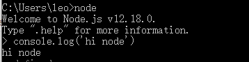

# NodeJS

`node.js`是一个异步的事件驱动的`JavaScript`运行时。

>运行时`rumtime`就是程序运行的时候。   
>运行时库就是程序运行的时候所需要依赖的库。   
>运行的时候指的是指令加载到内存并由`CPU`执行的时候。  
>C代码编译成可执行文件的时候，指令没有被`CPU`执行，这个时候算是编译时，就是编译的时候。

`node.js`特性其实是`JS`的特性：
- 非阻塞I/O
- 事件驱动


**与前端的不同**
- `JS`核心语法不变
- 前端 `BOM DOM`
- 后端 `fs http buffer event os`

在官网下载对应版本进行安装即可
安装好后输入`node`进入node命令行




## 基础

新建一个js文件

```javascript
consle.log('hi node');
```
输入`node filename`即可运行该文件，每次修改文件后需要重新启动。

**安装nodemon可以监听文件的改动，自动重启** 

```bash
npm i -g nodemon
```
输入`nodemon filename`启动。

## 核心API

### fs-文件系统

`fs.readFileSync()`同步调用

```javascript
const fs = require('fs');
const data= fs.readFileSync('./data.txt');
console.log('同步读取，等到文件读取完后才会执行');
console.log(data.toString());
```


`fs.readFile()`异步调用

```javascript
fs.readFile('./data.txt', (err, data) => {
  if(err) throw err;
  console.log(data.toString());
})
console.log("执行其他操作");
```

**读取数据类型为`Buffer`，需要通过toString()方法进行转换**

**path**

`fs`常常用来跟`path`搭配使用

```javascript
const path = require('path') 
fs.readFile(path.resolve(path.resolve(__dirname,'./data.txt')), (err, data) => { 
  if (err) throw err; 
  console.log(data.toString()); 
});

```

**Buffer**
用于在 TCP 流、文件系统操作、以及其他上下文中与八位字节流进行交互。 八位字节组成的数组，可以有效的在JS中存储二进制数据。

```javascript
// 创建一个长度为2字节以0填充的Buffer 
const buf = Buffer.alloc(2); 
console.log(buf);
// <Buffer 00 00>

// 创建一个Buffer包含ascii. 
const buf2 = Buffer.from('a') 
console.log(buf2) 
// <Buffer 61>

// 创建Buffer包含UTF-8字节 
// UFT-8：一种变长的编码方案，使用 1~6 个字节来存储； 
// UFT-32：一种固定长度的编码方案，不管字符编号大小，始终使用 4 个字节来存储； 
// UTF-16：介于 UTF-8 和 UTF-32之间，使用 2 个或者 4 个字节来存储，长度既固定又可变。
const buf3 = Buffer.from('实例'); 
console.log(buf3);
// <Buffer e5 ae 9e e4 be 8b>

// 采用toString()方法读取buffer数据
console.log(buf3.toString()); // 实例

// buffer数据也是可以合并的
const buf4 = Buffer.concat([buf2,buf3])
console.log(buf4)
// <Buffer 61 e5 ae 9e e4 be 8b> 就是将两个buffer结合起来
console.log(buf4.toString()); // a实例

```

**http**

用于创建`web`服务的模块。

```javascript
const http = require('http'); 
const server = http.createServer((request, response) => { 
  console.log('有个请求'); 
  response.end('响应了'); 
}); 
server.listen(3000,()=>{
  console.log(`server start at localhost:3000`)
});
```

路由匹配

```javascript
const http = require('http'); 
const server = http.createServer((request, response) => { 
  const {url,method} = request;
  if(url === '/' && method === 'GET'){
    response.end('响应/请求')
  }else if(url === '/api' && method === "GET"){ // 返回一个json数据
    response.writeHead(200,{'Content-Type':'application/json'})
    response.end(JSON.stringify([{code:200,message:'访问成功'}]))
  }
}); 
server.listen(3000,()=>{
  console.log(`server start at localhost:3000`)
});
```

**stream**

用于node中流数据的交互

```javascript
const fs = require('fs')
const read = fs.createReadStream('./b.js'); // 创建一个读取流读取b文件
const write = fs.createWriteStream('./c.js') // 创建一个写入流写入c文件
read.pipe(write) // 创建一个管道，读取流流入到写入流中
```

**events**

事件驱动，是node的基石，几乎被所有的模块依赖。

```javascript
const events = require('events')
const emitter = new events.EventEmitter();
emitter.on('event1',(...args)=>{
  console.log('监听event',...args)
})
emitter.emit('event1','触发吧')
// 监听event 触发吧
```
`error`事件

```javascript
emitter.emit('error');
```
大多数时候我们不会直接使用 EventEmitter，而是在对象中继承它。包括 fs、net、http 在内的，只要是支持事件响应的核心模块都是 EventEmitter 的子类。

**os**

提供了一些基本的系统操作函数
```javascript
const os = require('os')
const mem = os.freemem() / os.totalmem() * 100; 
console.log(`内存占用率${mem.toFixed(2)}%`)