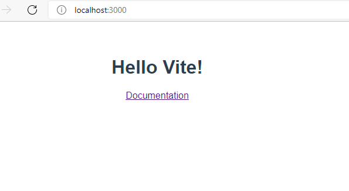
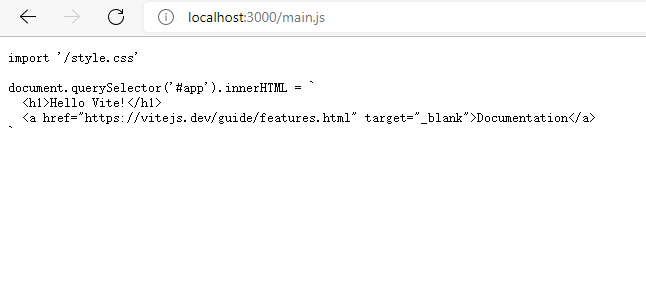
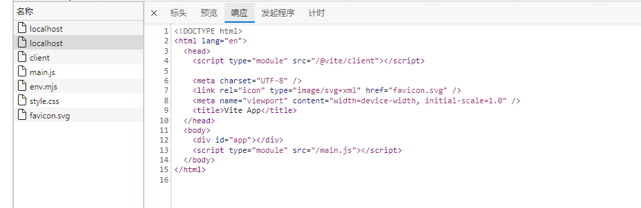
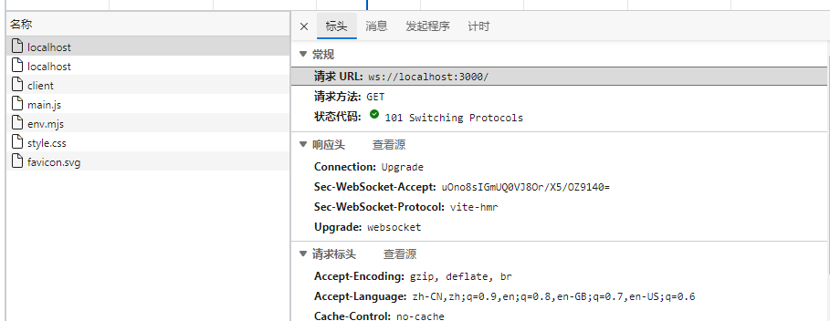

# `vite` 基础知识
`vite`是尤雨溪开发的`web`开发构建工具，它是一个基于浏览器原生`ES-Module`的前端构建工具，在开发环境下，利用浏览器去解析`import`，在服务器端按需编译返回，完全跳过了打包这个概念，服务器随启随用。支持热更新，并且热更新的速度不会随着模块增多而变慢。在生产环境下则是使用`rollup`打包。

## 特点
- 快速的冷启动
- 即时的模块热更新
- 真正的按需编译

## 搭建`vite`项目

与`vue-cli`类似，`vite`也提供用`npm`或者`yarn`来生成项目结构的方式。

使用`npm`
```bash
npm init vite@latest
```

使用`yarn`
```bash
yarn create vite
```

使用`pnpm`
```bash
pnpm create vite
```

然后按照提示操作选择模板即可。

1. 运行命令 `pnpm create vite`
2. 输入项目名 vite-project
3. 选择模板 vanilla
4. 选择语言为js版
5. 安装依赖 `npm install`
6. 运行项目 `npm run dev`

在浏览器上打开相应地址：




再来看看项目目录，可以发现目录中的结构非常简单。当然这个模板选用的是`vanilla`，其他模板的话目录是不一样的。


需要注意的是所有的模板中的`index.html`文件都是在项目根目录下的，这是因为在启动`vite`服务后，访问的根目录是这个项目的根目录。

比如我们访问`localhost:3000/main.js`，那么打开的就是项目根目录下的`main.js`文件。



## 机制

我们知道，`vite`其实就是一个服务器，在启动的时候构建一个`web server`, 在访问`localhost:3000`这个地址的时候向`serve`发送请求，然后返回相关的文件信息。这个工作机制也正是`vite`快的原因，在这里，由于视图只会请求到他使用到的文件，而`vite`只会拦截被请求到的文件，所以那些没有被引用到的文件就不会被编译，这就做到了按需编译。通过浏览器中开发者工具可以看到发送的请求。



`vite`中有个缓存机制，当文件未修改而页面刷新时，并不会重新发送请求。


`vite`在启动了一个`server`的同时还启动了`websocket`来实现`hmr`热更新。



热更新原理：

通过获取请求的文件，匹配找到所有有引用关系的文件并进行监听，当文件发生变动时，通过`websocket`发送消息给浏览器进行更新操作。


## more
今天开始`vite`源码解读系列，后续会不断更新`vite`的原理剖析文章。