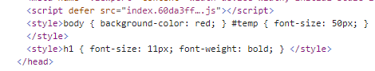
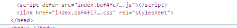

# webpack

## 基础知识

`webpack` 是一个用于现代 `JavaScript` 应用程序的静态模块打包工具。当 `webpack` 处理应用程序时，它会在内部从一个或多个入口点构建一个依赖图(`dependency graph`)，然后将你项目中所需的每一个模块组合成一个或多个 `bundles`，它们均为静态资源，用于展示你的内容。

webpack安装命令，在安装前需确保有node.js环境。
```bash
npm install webpack -g
```

`webpack`具有以下几个核心概念：
- entry
- output
- loader
- plugin
- mode


###  `entry`

指示 `webpack` 应该使用哪个模块，来作为构建其内部依赖图(`dependency graph`) 的开始。

默认值是 `./src/index.js`，但你可以通过在 `webpack configuration` 中配置 `entry` 属性，来指定一个（或多个）不同的入口起点。

1、 单入口（简写）语法    
`entry: string | [string]`
```js
module.exports = {
  entry: "./src/index.js",
};
```
 可以将一个文件路径数组传递给 entry 属性，这将创建一个所谓的 "multi-main entry"。在你想要一次注入多个依赖文件，并且将它们的依赖关系绘制在一个 "chunk" 中时，这种方式就很有用。
```js
module.exports = {
  entry: ["./src/index.js", "./src/index2.js"],
};
```
不管是单个入口还是多个入口，如果没有指定输出，都只会生成一个bundle文件。

2、对象语法
`entry: { <entryChunkName> string | [string] } | {}`
```js
module.exports = {
  // 单入口对象
  //   entry: {
  //     app: "./src/index.js",
  //   },

  // 多入口对象
  entry: {
    app: "./src/index.js",
    adminApp: "./src/index2.js",
  },
};
```

3、描述入口的对象
- `dependOn`: 当前入口所依赖的入口。它们必须在该入口被加载前被加载。
- `filename`: 指定要输出的文件名称。
- `import`: 启动时需加载的模块。
- `library`: 指定 `library` 选项，为当前 `entry` 构建一个 `library`。
- `runtime`: 运行时 `chunk` 的名字。如果设置了，就会创建一个新的运行时 `chunk`。在 `webpack 5.43.0` 之后可将其设为 `false` 以避免一个新的运行时 `chunk`。
- `publicPath`: 当该入口的输出文件在浏览器中被引用时，为它们指定一个公共 `URL` 地址.


### 2. `output`

指定`webpack`输出`bundle`文件的目录，以及文件命名。主要输出文件的默认值是 `./dist/main.js`，其他生成文件默认放置在 `./dist` 文件夹中。可以通过在 `webpack configuration` 中配置 `output` 属性。

注意： **即使可以存在多个 entry 起点，但只能指定一个 output 配置**

```js
const path = require("path");

module.exports = {
  entry: "./src/index.js",
  output: {
    // 生成bundle文件的目录
    path: path.resolve(__dirname, "dist"),
    // 文件名
    filename: "my-first-webpack.bundle.js",
  },
};
```

多个入口
如果配置中创建出多于一个 `"chunk"`（例如，使用多个入口起点或使用像 `CommonsChunkPlugin` 这样的插件），则应该使用 占位符(`substitutions`) 来确保每个文件具有唯一的名称。

```js
module.exports = {
  entry: {
    app: "./src/index.js",
    adminApp: "./src/index2.js",
  },
  output: {
    filename: "[name].js",
  },
};
```
`[name]`就是`entry`中各个入口文件的`chunkName`。

`[contenthash]` substitution 将根据资源内容创建出唯一 `hash`。
```js
module.exports = {
  output: {
    // filename: "[name].js",
    filename: "[name].[contenthash].js"
  },
};
```
`contenthash`默认长度是20，可以通过`[contenthash:8]`来指定长度。


### 3. loader
`webpack` 只能理解 `JavaScript` 和 `JSON` 文件，如果要处理其他类型的文件，需要使用`loader`将其转换成有效模块。
在 `webpack` 的配置中，`loader` 有两个属性：
- `test` 属性，识别出哪些文件会被转换。
- `use` 属性，定义出在进行转换时，应该使用哪个 `loader`。


比如说要处理一个`txt`文件。
```js
const path = require("path");

module.exports = {
  entry: "./src/index.js",
  output: {
    // 生成bundle文件的目录
    path: path.resolve(__dirname, "dist"),
    // 文件名
    filename: "my-first-webpack.bundle.js",
  },
  module: {
    rules: [{ test: /\.txt$/, use: "raw-loader" }],
  },
};

```
> 请记住，使用正则表达式匹配文件时，你不要为它添加引号。也就是说，`/\.txt$/` 与 `'/\.txt$/'` 或 `"/\.txt$/"` 不一样。前者指示 `webpack` 匹配任何以 `.txt` 结尾的文件，后者指示 `webpack` 匹配具有绝对路径 `'.txt'` 的单个文件; 这可能不符合你的意图。

#### 使用loader

在`webpack`中有两种使用`loader`的方式：
- 配置方式： 在`webpack.config.js`文件中指定`loader`.
- 内联方式：在每个`import`语句中显式指定`loader`

1. 配置方式
在`module.rules` 中进行配置指定多个 `loader`.
`loader` 从右到左（或从下到上）地取值(`evaluate`)/执行(`execute`)。
```js
module.exports = {
  module: {
    rules: [
      {
        test: /\.css$/,
        // 从右至左
        // use: ["style-loader", "css-loader"],

        // 从下到上
        use: [
          { loader: "style-loader" },
          {
            loader: "css-loader",
            options: {
              modules: true,
            },
          },
        ],
      },
    ],
  },
};
```

2. 内联方式

可以在 `import` 语句或任何 与 "`import`" 方法同等的引用方式 中指定 `loader`。使用 ! 将资源中的 `loader` 分开。每个部分都会相对于当前目录解析。
```js
import Styles from 'style-loader!css-loader?modules!./styles.css';
```

通过为内联 `import` 语句添加前缀，可以覆盖 配置 中的所有 `loader`, `preLoader` 和 `postLoader`：

使用 `!` 前缀，将禁用所有已配置的 `normal loader`(普通 `loader`)
```js
import Styles from '!style-loader!css-loader?modules!./styles.css';
```
使用 `!!` 前缀，将禁用所有已配置的 `loader`（`preLoader`, `loader`, `postLoader`）
```js
import Styles from '!!style-loader!css-loader?modules!./styles.css';
```
使用 `-!` 前缀，将禁用所有已配置的 `preLoader` 和 `loader`，但是不禁用 `postLoaders`
```js
import Styles from '-!style-loader!css-loader?modules!./styles.css';
```

// TODO preloader 、 loader 、 postloader


### 4.`plugin`
`loader` 用于转换某些类型的模块，而插件则可以用于执行范围更广的任务。包括：打包优化，资源管理，注入环境变量。

`webpack` 插件是一个具有 `apply` 方法的 `JavaScript` 对象。`apply` 方法会被 `webpack compiler` 调用，并且在 整个 编译生命周期都可以访问 `compiler` 对象。

使用一个插件，只需要在配置文件中通过 `require()`引入。由于插件可以携带参数/选项，你必须在 `webpack` 配置中，向 `plugins` 属性传入一个 `new` 实例。

取决于你的 `webpack` 用法，对应有多种使用插件的方式。

安装`html-webapck-plugin`

```bat
npm i --save-dev html-webpack-plugin
```

```js
const HtmlWebpackPlugin = require("html-webpack-plugin");

module.exports = {
  // ..
  plugins: [new HtmlWebpackPlugin({ title: "webpack" })],
};
```

`html-webpack-plugin` 为应用程序生成一个 `HTML` 文件，并自动将生成的所有 `bundle` 注入到此文件中。


### 6. mode
通过选择 `development`, `production` 或 `none` 之中的一个，来设置 `mode` 参数，你可以启用 `webpack` 内置在相应环境下的优化。其默认值为 `production`。

```js
module.exports = {
  mode: "development",
  // ..
};
```

## 配置HTML模板

在前面的基础知识中，我们简单介绍了`webpack`的一些配置，虽然`js`文件打包好了，但是我们不可能每次在`html`文件中手动引入打包好的`js`（使用占位符生成文件名导致生成的`js`名称变动）。

`html-webpack-plugin`这个插件可以将打包生成的`js`文件引入`html`中。
```js
const path = require("path");
const HtmlWebpackPlugin = require("html-webpack-plugin");
module.exports = {
  mode: "development",
  entry: path.resolve(__dirname, "./src/main.js"),
  output: {
    filename: "[name].[hash:8].js",
    path: path.resolve(__dirname, "./dist"),
  },
  plugins: [
    // new HtmlWebpackPlugin({
    //   template: path.resolve(__dirname, "./public/index.html"),
    // }),
    
    // 自动生成html
    new HtmlWebpackPlugin({
      title: "自动生成"
    }),
  ],
};
```
配置后，生成的`html`会自动引入打包后的文件。如果没有模板`html`，在使用了`html-webpack-plugin`后会自动生成一个引入了打包文件的`html`文件。

### 多入口文件
```js
const path = require("path");
const HtmlWebpackPlugin = require("html-webpack-plugin");
module.exports = {
  mode: "development",
  entry: {
    main: path.resolve(__dirname, "./src/main.js"),
    index: path.resolve(__dirname, "./src/index.js"),
  },
  output: {
    filename: "[name].[hash].js",
    path: path.resolve(__dirname, "./dist"),
    clean: true,
  },
  plugins: [
    new HtmlWebpackPlugin({
      title: "main",
      filename: "main.html",
      chunks: ["main"],
    }),
    new HtmlWebpackPlugin({
      title: "index",
      filename: "index.html",
      chunks: ["index"], // 与入口文件对应的模块名
    }),
  ],
};
```

## 引用css
在基础知识`loader`中我们介绍了`webpack`只能解析`js`和`json`文件，现在我们来看一个css文件如何处理。

引入一些`loader`:
```bash
npm i --save-dev style-loader css-loader
```
如果我们使用`less`来构建样式，则需要多安装两个
```bash
npm i -D less less-loader
```

```js
module.exports = {
  // ..
  module: {
    rules: [
      {
        test: /\.css$/,
        use: ["style-loader", "css-loader"],
      },
    ],
  },
};
```



这时候我们发现`css`通过`style`标签的方式添加到了`html`文件中，但是如果样式文件很多，全部添加到`html`中，难免显得混乱。这时候我们想用把`css`拆分出来用外链的形式引入`css`文件怎么做呢？这时候我们就需要借助插件来帮助我们。

### 拆分`css`
使用`mini-css-extract-plugin`插件。
```bash
npm i -D mini-css-extract-plugin
```

```js
module.exports = {
  // ..
  module: {
    rules: [
      {
        test: /\.css$/,
        use: [MiniCssExtractPlugin.loader, "css-loader"],
      },
    ],
  },
  plugins: [
    new MiniCssExtractPlugin({
      filename: "[name].[hash].css",
      chunkFilename: "[id].css",
    })
  ],
};
```


`mini-css-extract-plugin`会将所有的`css`样式合并为一个`css`文件，也就是说不管你有多少个`css`文件，最终都只会打包生成一个`css`文件，通过`link`标签引入。

### 拆分多个`css`
如果想拆分成多个`css`文件，则需要使用另外一个插件,@next版本的`extract-text-webpack-plugin`. 只支持`webpack^3.x`和`webpack^4.x`。

```bash
npm i -D extract-text-webpack-plugin
```

## 打包图片、字体、媒体等文件
[`file-loader`](https://v4.webpack.js.org/loaders/file-loader/) 就是在 `JavaScript` 代码里 `import/require` 一个文件时，会将该文件生成到输出目录，并且在 `JavaScript` 代码里返回该文件的地址。

安装
```bash
npm i --save-dev file-loader
```

```js
module.exports = {
  // ..
  module: {
    rules: [
      {
        test: /\.(jpe?g|png|git)$/i,
        use: [
          {
            loader: "file-loader",
            options: {
              name: "[name].[hash:8].[ext]",
              outputPath: "pics"
            },
          },
        ],
      },
    ],
  }
};
```
上面的配置会将图片资源打包至`pics`目录下.

`file-loader`常用options配置
- `name`: 类型: `String|Function` 默认: '`[contenthash].[ext]`'， 打包后的文件名。
- `outputPath`: 类型: `String|Function`, 保存打包后的文件目录。
- `publicPath`: 类型: `String|Function`, 默认: `__webpack_public_path__`+ `outputPath`, 公开访问路径。

常用占位符：
- `[ext]`: 源文件后缀
- `[name]`: 源文件名称
- `[hash]`: 文件内容`hash`


`url-loader` 功能与 `file-loader` 类似，如果文件小于限制的大小。则会返回 `base64` 编码，否则使用 `file-loader` 将文件移动到输出的目录中。


```js
module.exports = {
  // ..
  module: {
    rules: [
      {
        test: /\.(jpe?g|png|git)$/i,
        use: [
          {
            loader: "url-loader",
            options: {
              limit: 10240,
              fallback: {
                loader: "file-loader",
                options: {
                  name: "img/[name].[hash:8].[ext]",
                },
              },
            },
          },
        ],
      },
    ],
  }
};
```

`options`配置
- `limit`: 文件限制大小，如果小于限制，则会返回 `base64` 编码。
- `fallback`: 当文件大小超出限制时使用另外一个`loader`

上方的配置大小超过`10k`的图片使用`file-loader`，小于`10k`就用`base64`编码。
来看看小于`10k`最终会被打包成
```js
 "data:image/png;base64,iVBORw0KGgoAAAANSUhEUgAAAJEAAAAtCAYAAACu0IktAAAAAXNSR0IArs4c6QAAAARnQU1BAACxjwv8YQUAAAAJcEhZcwAADsMAAA7DAcdvqGQAAAebSURBVHhe7Zxbb1VFGIb9Jd6rN96IiYkxQdQLIB5IDBATQCUaFFEJKnABRE7BCNuImggVIwlojQdSU4JiJYK1BQxIy5kqysEW+A9jn1Xf1W+P396LfWjZLXPxZHfNfDN71syzZs067N5xzwNTQyLRCEmiRMMkiRINkyRKNMy4SfTWmg3h5JlzYcOWrW5+YuIy5hItWLw0HDjUHYau38g51tcfXlu5xo1PTDzGTKIZc+aF9m87cnGO/309+zz858gn7Os6EJ55YbFbPjFxaLpEU6bNCFu3f5qLMnD1Rth5Yiis7R7MtvlsOzYUTl8elWln+1fh0Vlz3foSrU9TJVq18d1w4Y+LmRiXBm+EvWevZdIISSS+7L+WxUmmzR9+HO596DG37kTr0hSJXly6PHQfPprLsP/8tbCpd1QWEUsExCGbZDp19ly2CPe+J9GaNCTRrHkLw57Ofbk8rHtKR0ZOXR6eRIJyhwZGT3Esxp8dXpR735toLeqS6MHpT4Vtn+3KB5x1D+scTw5ROjIiEZ9evqAeLcKBxfnMOfPddtwqZi98OawrfZDB315MKzL18afzdi9ZudqNqYeaJVq3+f1w6crVbIA5BbGu8WQQm3oGQ+eZkdNV+y/nsnLZ6W443YsX1IuckonFuteeW8H60tZw8eo/GfztxbQiCK92d+zvcmPqoWaJ+k+fyQaVAS4Sob1/KJOn8+hAuH/N9+HO1zuyz7au0yPpw3IV1WGv4u57eLrbpvEmSVRO3RJxyrGX7xbSyDvY/1d4svRzJk8M6chFHLLFdeg2QJKoebScRFYWhProt6F8PXP8wpWwaEevK08MMhGPLJRnzcQNSXuqrCbR7IUv5cR5M+cuqJhny015ZGZZHuVWrNuU4ZX1JFKZV1asytYecZm4LXznc0uW/beu+n8bLJSlXmL5ZNuLE7Yttv3VJLLt89pfjYYkgvgSvdTZ58pSxBu7j+SyxLcIlO5JdOrCQN4x8SJX6WA7hgHz8ujI3t/7yvKANFu3lejzPd+Fru6esnjo+KGrTAwGTXksak+eH203sI0kigck8NoDu4e/Nxbv+VeXVW1/JYlsOv057hIJ1jfMKAOXBzMhPFEqsWhHT1YOmMniuqtJ1LarPe8Ae2qxHQMr17+T59HZSv/p194sDYHigY2RSFaiaiCXBtpKVA27D3bfPN7btiOPRUwvRpDvSUT77H7TN6rzZmmqRG9/fSxf6yDUE1v89ZAgX7GUo3ytElkh7NEVDzQzhvLofKVr0OwRTL4G39aDFF7diEg7GKQ4T/XHEtEe4oG/bZ5mAj7JkwCIbtvO4CvOlqeMbQ+zC/vDtmLUV3YWVVtrpekSSRDWRMws2ZXZ6pErM8F224+nsvw3dx/N0+uRiM5RJ4DS41OMOjzOY2BA25qZLKQpnwGzohw+0ZcLJ5j1lC/xrERWaGFFsjOMsN9hT+FsW7G8ulU2lsiWswdgrYyZRHD38r1h7TfHs3jykIdP5EEi8m18PRKBHQA6yoplOwpZbB4CUN5KwYzEesZip3sd3dqudPQqH9i2ElFHHO/NEgi7fdcXeTogpZ01iSuqW9jvsPvkHQi1MKYSCe4N6UYjM9O0jV1uXL0S2SOfQbWnOAZCR26cx5qD8laKIviu8ZCIQY1nU4+4bvY3rlvY70Ac/Y1Q1coVMS4SCcp56aJeiegAdQgdqgWpTk3aJs/OTAhFvpWQWY3OrgTfZSWqdOpRPpBmB1rfa7FyE2vbxLZmCtqgdCCtqG5hy1LG7gczrlfmZpgUEoE9sjTda4DtlYs9ulXWrokoG0/tbNvBsZ3PURzH23yJbAfaGzDSlE+7bR2038bG+2APDK3BLJ6AtIc022+Ia8vdLJNGItuRgk4jj06M8+IFqB1kRNKNRj61fmB9QqwdYCCfezzcPIzXMBLA1g9Iw30g6o9PW8x2diYiX6cb4m0saeTZxTbxak9p2ye56J5ENo04DijSa2HSSGQ7A+hUm2+vsCA+uuOB8Kh1DaV4iCWqBHUTz6AXtQdUv51tPcj3JIKimayIpkjEowo94+KqK76kF5Ukumv4Ko073eTzGIVHKLZ+0qGaRGA7PZ5p4oHXkW1h4LR+sjDlW+lsXcwYsSC0QzIIG0MZexpRmfh0wqwQ1005m1YUD6Sxv5UkYr9te+K2F9GQRDyB5xEF28xE9sUyZhXksLKQbrfJJ45L/oMDI+X1CIVtPeGnHBRJ1Cw09YMnmwcDqDJevh1cxRSVERKgKE7YePbFi2kmdUuk1zx4WBq/zcg26chhH4FYiXjUwZ1qTl/xC208N0NGvS4y3hKNBZ5Ek4W6JWKAvddALOVP9Xuycjzq4BURTluxPDGc1vRgN0nUutQsUfxmo/cuUIx9S5EyRW9DAvWqDLTSm431kCSKqOcdayC26E1GzV6quxXfsU6UU5dEwv+1hy8HEOOlA+VYTKuu9GuPiUNDEgn3d2fOjONJRByLZ6190u/OJh5NkUjEv4BFDitMLJGu8EiH9AvYiUlTJYL0W/zbj6ZLJNJ/Bbl9GDOJRPr/RJOfMZdIpP+UNnkZN4kSk5ckUaJhkkSJhkkSJRomSZRomCRRokGmhn8BW7jHTzc1goUAAAAASUVORK5CYII="
```

图片的`url`地址被默认转化为了base64格式，如果一张图片太大的话，这样的转换反而降低效率,所以还不如用`http`请求.

媒体跟字体的打包也跟图片一样。


`file-loader` 和 `url-loader` 在 `webpack5` 就弃用了，取而代之是[资源模块(`asset module`)](https://webpack.docschina.org/guides/asset-modules/)。


## 资源模块
资源模块(`asset module`)是一种模块类型，它允许使用资源文件（字体，图标等）而无需配置额外 `loader`。

通过添加 4 种新的模块类型，来替换所有这些 `loader`:
- `asset/resource` 发送一个单独的文件并导出`URL`。之前通过使用 `file-loader` 实现。
- `asset/inline` 导出一个资源的 `data URI`。之前通过使用 `url-loader` 实现。
- `asset/source` 导出资源的源代码。之前通过使用 `raw-loader` 实现。
- `asset` 在导出一个 data URI 和发送一个单独的文件之间自动选择。之前通过使用 `url-loader`，并且配置资源体积限制实现。


### `Resource`资源
```js
module.exports = {
  // ..
  module: {
    rules: [
      {
        test: /\.png/,
        type: "asset/resource",
      },
    ],
  },
};
```
所有 `.png` 文件都将被发送到输出目录，并且其路径将被注入到 `bundle` 中

#### 自定义输出文件名
默认情况下，`asset/resource` 模块以 `[hash][ext][query]` 文件名发送到输出目录。不过有以下几个方法对输出的文件名进行修改。

1. `output.assetModuleFilename`
```js
module.exports = {
  output: {
    filename: "main.js",
    path: path.resolve(__dirname, "dist"),
    clean: true,

    // 修改模板字符串
    assetModuleFilename: "images/[hash][ext][query]",
  },
  module: {
    rules: [
      {
        test: /\.png/,
        type: "asset/resource",
      },
    ],
  },
};
```

2. 将某些资源发送到指定目录

```js
module.exports = {
  output: {
    filename: "main.js",
    path: path.resolve(__dirname, "dist"),
    clean: true,
    assetModuleFilename: "images/[hash][ext][query]",
  },
  module: {
    rules: [
      {
        test: /\.png/,
        type: "asset/resource",
      },
      {
        test: /\.html/,
        type: "asset/resource",

        // 将文件发送到输出目录中
        generator: {
          filename: "static/[hash][ext][query]",
        },
      },
    ],
  }
};
```

`Rule.generator.filename` 与 `output.assetModuleFilename` 相同，并且仅适用于 `asset` 和 `asset/resource` 模块类型。

### `inline`资源
```js
module.exports = {
  // ..
  module: {
    rules: [
      {
        test: /\.png/,
        type: "asset/inline",
      },
      {
        test: /\.svg/,
        type: "asset/inline",
      },
    ],
  },
};
```
所有 `.svg`和`.png` 文件都将作为 `data URI` 注入到 `bundle` 中。


### `source`资源

```js
module.exports = {
  module: {
    rules: [
      {
        test: /\.txt/,
        type: "asset/source",
      },
    ],
  }
};
```

### 通用资源类型

将`type`值设置成`asset`,`webpack` 将按照默认条件，自动地在 `resource` 和 `inline` 之间进行选择：小于 `8kb` 的文件，将会视为 `inline` 模块类型，否则会被视为 `resource` 模块类型。

```js
module.exports = {
  module: {
    rules: [
      {
        test: /\.png/,
        type: "asset",
      },
      {
        test: /\.svg/,
        type: "asset",
      },
    ],
  }
};
```

也可以在`Rule.parser.dataUrlCondition.maxSize` 配置中修改限制条件。
```js
module.exports = {
  module: {
    rules: [
      {
        test: /\.png/,
        type: "asset",
        parser: {
          dataUrlCondition: {
            maxSize: 1 * 1024,
          },
        },
      },
      {
        test: /\.svg/,
        type: "asset",
        parser: {
          dataUrlCondition: {
            maxSize: 0.5 * 1024,
          },
        },
      },
    ],
  },
};
```