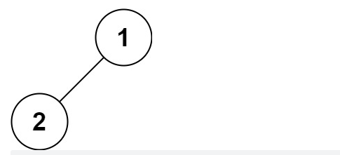

# 二叉树的中序遍历
给定一个二叉树的根节点 root ，返回它的 中序 遍历。

示例 1：


```js
输入：root = [1,null,2,3]
输出：[1,3,2]
```

示例2：

```js
输入：root = []
输出：[]
```

示例3：

```js
输入：root = []
输出：[]
```

示例4：



```js
输入：root = [1,2]
输出：[2,1]
```

示例5：


```js
输入：root = [1,null,2]
输出：[1,2]
```
>提示：
- 树中节点数目在范围 [0, 100] 内
- -100 <= Node.val <= 100
 

进阶: 递归算法很简单，你可以通过迭代算法完成吗？


中序遍历：从根节点出发，当第二次到达结点时就输出结点数据，按照先向左在向右的方向访问。如果没有子节点，就输出当前节点数据。

```js
/**
 * Definition for a binary tree node.
 * function TreeNode(val, left, right) {
 *     this.val = (val===undefined ? 0 : val)
 *     this.left = (left===undefined ? null : left)
 *     this.right = (right===undefined ? null : right)
 * }
 */
/**
 * @param {TreeNode} root
 * @return {number[]}
 */
var inorderTraversal = function(root) {
    const result = [];
    walk(root);
    function walk(node) {
        if(!node) {
            return;
        }
        walk(node.left);
        result.push(node.val);
        walk(node.right);
    }
    return result;
};
```